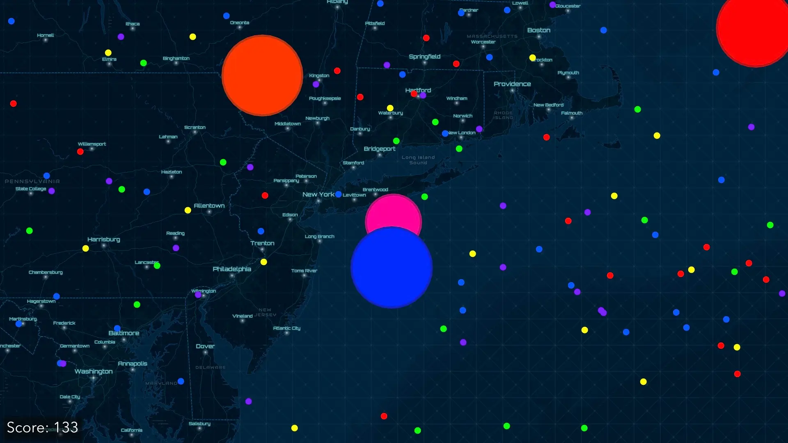

# geo-io

Agar.io, but more mappy.



Features 3 modes:

- Competitive - eat particles, eat NPCs, and don't get eaten.
- Vampire - leach mass off NPCs and don't let others leach off you.
- Explorer - peacefully explore the map and collect particles.

## TODO

- DOCS: Update metadata and prepare slides
- DOCS: Schedule preparation sessions

## Installation

- Clone this repository:

  ```sh
  git clone https://github.com/maxpatiiuk/geo-io/
  ```

- Install dependencies:

  ```sh
  npm install
  ```

- Run the app:

  ```sh
  # For Development:
  npm run dev
  # For Production:
  npm run build && npm run preview
  ```

## Credits

- Inspired by [agar.io](https://agar.io/)
